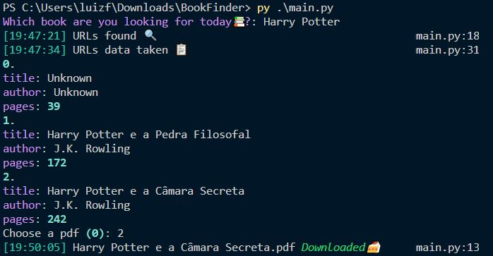

# BookFinder :mag: :book:
 Ferramenta simples que utiliza google dorks para encontrar e baixar pdf de livros :books: :sparkles:

 ## Instalação :arrow_heading_down:
 ```
 $ git clone https://github.com/Lzsx/BookFinder/tree/master
 $ cd BookFinder
 $ pip install -r requirements.txt
 ```
 ## Showcase :camera:
 